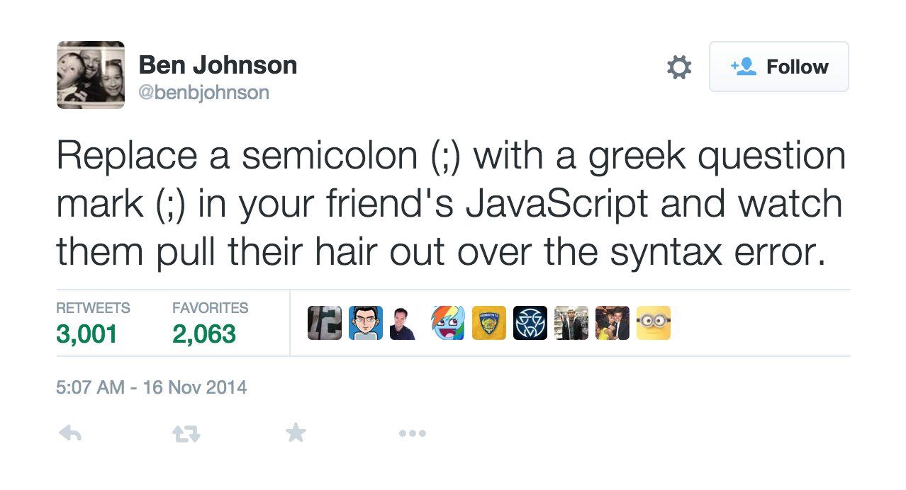

olc 
===

[![NPM version][npm-image]][npm-url] [![Build Status][travis-image]][travis-url] [![Windows Build Status][appveyor-image]][appveyor-url] [![Dependency Status][depstat-image]][depstat-url] 

---

Ruins days by replacing characters with a homograph / homoglyph (like substituting semi-colons with the Greek question mark). Olc is the Irish word for bad.

Inspired by Ben Johnson's [tweet](https://twitter.com/benbjohnson/status/533848879423578112);

[](https://twitter.com/benbjohnson/status/533848879423578112)

By default, that's all that plugin does but can replace [other homographs](homographs.json) via [options](#options). See the [test/expected](test/expected) directory for example output.

# Installation

```shell
npm install olc
```

# Basic usage (without Gulp)

You'll need to pass [Vinyl](https://github.com/gulpjs/vinyl) files, with a Buffer / Stream as content.

```js
var olc = require('olc');
var File = require('vinyl');

var file = new File({
    path: 'example/directory/file.js',
    cwd: 'example/',
    base: 'example/directory',
    contents: fs.createReadStream('example/directory/file.js')
    // or contents: new Buffer(fs.readFileSync('example/directory/file.js'))
});
// or instead of creating a new file with the vinyl module, just use my glob-to-vinyl module


var stream = olc();
stream.on('data', function(newFile){
    // Tada!
    // newFile now has Greek question marks instead of semi-colons
});

stream
    .write(file)
    .end();
```

# [Gulp](gulpjs.com) usage

```js
var gulp = require('gulp');
var olc = require('olc');

gulp.task('default', function() {
    gulp.src('*.js')
        .pipe(olc())
        .pipe(gulp.dest('./output'));
});
```

# Options

## Mode

If omitted, this option defaults to `greek`.

### Greek

```js
olc({
    mode: 'greek'
})
```

This mode only replaces semi-colons with the Greek question mark as the ~~specification~~ tweet says.

### One

```js
olc({
    mode: 'one'
})
```

This mode will chose a target homograph at random and replace it throughout each file. For extra confusion, if the character has multiple possible homographs, then both will used as a substitution (randomly per occurrence).

### All

```js
olc({
    mode: 'all'
})
```

Will replace all instances of the [homographs we look for](homographs.json) with their counterparts.

## charactersToReplace

```js
olc({
    charactersToReplace: ';)('
    // or charactersToReplace: [';', ')', '(']
})
```

This option (a string or array) of characters which should be replaced with their homographs. Characters which aren't one of [the homographs we look for](homographs.json) will be ignored.

If this option is given, the `mode` option is ignored.


[npm-url]: https://npmjs.org/package/olc
[npm-image]: http://img.shields.io/npm/v/olc.svg?style=flat

[travis-url]: http://travis-ci.org/adam-lynch/olc
[travis-image]: http://img.shields.io/travis/adam-lynch/olc.svg?style=flat

[appveyor-url]: https://ci.appveyor.com/project/adam-lynch/olc/branch/master
[appveyor-image]: https://ci.appveyor.com/api/projects/status/0c81jdoev69sexq0/branch/master?svg=true

[depstat-url]: https://david-dm.org/adam-lynch/olc
[depstat-image]: https://david-dm.org/adam-lynch/olc.svg?style=flat